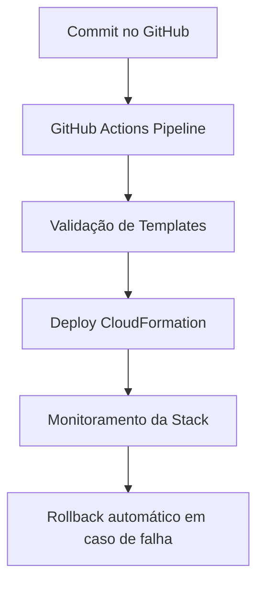

## Formação AWS Cloud Foundations.


---

# 🚀 AWS CloudFormation Infrastructure as Code Lab

## 🔥 Visão Geral

Este projeto demonstra a construção de uma **arquitetura completa de infraestrutura como código (IaC)** utilizando AWS CloudFormation, GitHub Actions e AWS CLI.

A proposta não é apenas provisionar recursos na nuvem, mas sim **simular um ambiente real de engenharia de plataforma (Platform Engineering)** com:

- automação de infraestrutura
- versionamento completo via Git
- validação de templates
- pipelines CI/CD
- controle de mudanças (Change Sets)
- rollback automático
- detecção de drift
- boas práticas de produção

---

## 🎯 Problema Resolvido

Ambientes de infraestrutura tradicionais sofrem com:

- provisionamento manual e lento
- inconsistência entre ambientes
- alto risco de erro humano
- falta de rastreabilidade
- dificuldade de rollback
- ausência de padronização

---

## 💡 Solução Proposta

Este projeto implementa uma solução baseada em **Infrastructure as Code (IaC)** com AWS CloudFormation para garantir:

- infraestrutura 100% declarativa
- ambientes reproduzíveis
- automação completa via CI/CD
- segurança e governança nativas da AWS
- controle total do ciclo de vida da infraestrutura

---

## 🧠 Objetivo Técnico

Este laboratório foi construído com foco em:

- práticas reais de DevOps e Cloud Engineering
- simulação de ambiente corporativo AWS
- pipeline de infraestrutura profissional
- preparação para entrevistas de nível júnior/pleno/sênior

---

## 🏗️ Arquitetura do Projeto

```
.
├── templates/                # Infraestrutura CloudFormation
├── scripts/                  # Automação CLI (deploy, validate, delete)
├── docs/                     # Documentação técnica completa
├── examples/                 # Exemplos práticos de uso
├── .github/workflows/       # Pipelines CI/CD
├── .gitignore
└── README.md
```

---

## ⚙️ Tecnologias Utilizadas

- AWS CloudFormation
- AWS CLI
- IAM (Identity and Access Management)
- GitHub Actions
- YAML / JSON
- Bash Scripts
- Git & GitHub

---

## 🔄 Fluxo de CI/CD



---

## 📦 Componentes da Infraestrutura

O projeto simula uma arquitetura real AWS contendo:

- VPC (Virtual Private Cloud)
- Subnets públicas e privadas
- EC2 Instances
- Security Groups
- IAM Roles
- Outputs e Parameters
- Estrutura modular de templates

---

## 🔐 Segurança

Implementado com foco em boas práticas:

- IAM Roles ao invés de credenciais fixas
- princípio do menor privilégio
- validação de templates antes do deploy
- integração com OIDC no GitHub Actions
- controle de mudanças via Change Sets

---

## 🧪 Validação e Qualidade

Antes de qualquer deploy:

- `cfn-lint` para validação de templates
- `validate-template` via AWS CLI
- análise de sintaxe YAML
- verificação de parâmetros

---

## 🔁 Gestão de Mudanças

O projeto utiliza:

- Change Sets (pré-visualização de mudanças)
- Stack Updates controlados
- versionamento Git completo
- rollback automático em falhas

---

## 📉 Drift Detection

Implementado para garantir consistência entre:

- infraestrutura real
- infraestrutura declarada em código

---

## ⚡ Como Executar

### 1. Clone o repositório

```bash
git clone https://github.com/Santosdevbjj/cloudformation-lab.git
cd cloudformation-lab
```

---

### 2. Configurar AWS CLI

```bash
aws configure
```

---

### 3. Validar template

```bash
aws cloudformation validate-template \
  --template-body file://templates/main.yaml
```

---

### 4. Deploy da Stack

```bash
bash scripts/deploy.sh
```

---

### 5. Delete da Stack

```bash
bash scripts/delete.sh
```

---

## 📊 Impacto Técnico do Projeto

Este projeto demonstra:

- automação real de infraestrutura AWS
- maturidade em DevOps e Cloud Engineering
- capacidade de estruturar pipelines CI/CD
- entendimento profundo de IaC
- aplicação de boas práticas corporativas

---

## 🧠 Aprendizados

- Infraestrutura deve ser tratada como código
- Automação reduz erro humano drasticamente
- CI/CD não é apenas para aplicação — também é para infraestrutura
- Change Sets são essenciais em ambientes críticos
- Drift é um problema real em produção
- Observabilidade é tão importante quanto deploy

---

## 🚀 Próximos Passos

- integração com Terraform multi-cloud
- implementação de Kubernetes (EKS)
- testes automatizados de infraestrutura (IaC Testing)
- integração com Security Hub AWS
- arquitetura multi-account AWS


---

## 🏁 Conclusão

Este projeto simula um ambiente real de engenharia de plataforma em nuvem, aplicando práticas utilizadas em empresas de tecnologia de grande porte.

Mais do que um laboratório, este repositório representa:

> 🔥 uma arquitetura real de produção em escala reduzida

---

## 📌 Status

✔ Projeto completo  
✔ Nível: Cloud Engineering (FAANG readiness)  
✔ Foco: Infraestrutura como Código (AWS CloudFormation)


---


## 👤 14. Autor

**Sérgio Santos** — Senior Data Engineer & Cloud Architect

15+ anos em sistemas bancários de missão crítica (Banco Bradesco S.A.) · DIO Campus Expert

[](https://portfoliosantossergio.vercel.app)
[](https://linkedin.com/in/santossergioluiz)

---
