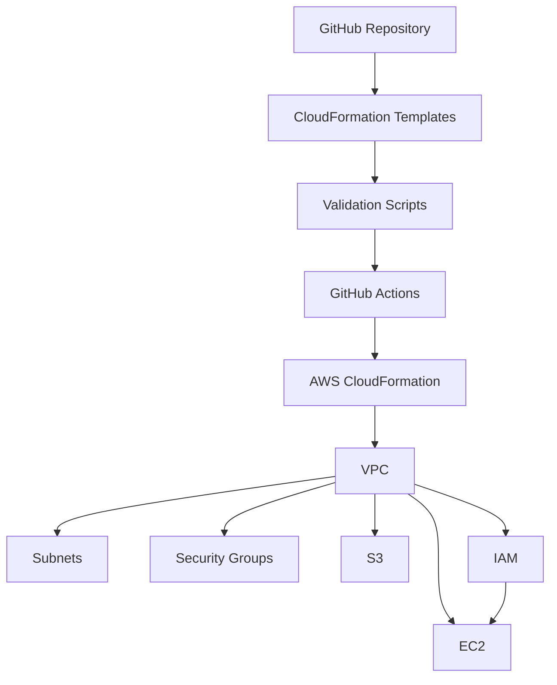

# Introdução

## Bem-vindo ao laboratório

Seja bem-vindo ao projeto **Implementando Infraestrutura Automatizada com AWS CloudFormation**.

Este repositório foi desenvolvido para demonstrar como aplicar os princípios de **Infrastructure as Code (IaC)** na Amazon Web Services (AWS), automatizando o provisionamento de infraestrutura de forma segura, reproduzível e escalável.

Mais do que apresentar templates do CloudFormation, este laboratório busca reproduzir práticas utilizadas por equipes de engenharia de plataforma (Platform Engineering), Cloud Engineering e DevOps em ambientes corporativos.

---

# O problema

Durante muitos anos, a criação de infraestrutura em nuvem foi realizada manualmente.

O processo normalmente envolvia:

- criação manual de VPCs;
- configuração de sub-redes;
- criação de Security Groups;
- provisionamento de instâncias EC2;
- configuração de buckets S3;
- definição de permissões IAM;
- configuração de rotas e gateways.

Embora funcional para ambientes pequenos, essa abordagem apresenta diversos desafios:

- erros humanos;
- inconsistência entre ambientes;
- dificuldade de auditoria;
- baixa rastreabilidade;
- tempo elevado para provisionamento;
- dificuldade para reproduzir ambientes.

À medida que a infraestrutura cresce, esses problemas aumentam significativamente.

---

# A solução

Infrastructure as Code (IaC) propõe uma mudança de paradigma.

Em vez de criar recursos manualmente, toda a infraestrutura passa a ser descrita em arquivos de texto versionados.

Esses arquivos definem exatamente quais recursos devem existir, suas configurações e seus relacionamentos.

Com essa abordagem, a infraestrutura torna-se:

- reproduzível;
- previsível;
- auditável;
- reutilizável;
- automatizável.

Na AWS, o principal serviço para implementar essa estratégia é o **AWS CloudFormation**.

---

# Objetivos deste projeto

Este laboratório possui diversos objetivos técnicos.

Entre eles:

- aprender Infrastructure as Code;

- compreender o funcionamento do AWS CloudFormation;

- construir templates reutilizáveis;

- automatizar o deployment da infraestrutura;

- validar templates antes do provisionamento;

- aplicar boas práticas de engenharia;

- documentar todas as decisões técnicas;

- estruturar um projeto profissional para portfólio.

---

# Público-alvo

Este material foi desenvolvido para:

- estudantes de computação;

- profissionais iniciando em Cloud Computing;

- engenheiros DevOps;

- Cloud Engineers;

- profissionais de infraestrutura;

- administradores de sistemas;

- arquitetos de soluções;

- candidatos a certificações AWS.

Também pode ser utilizado como material de consulta por profissionais experientes.

---

# O que será construído

Ao longo deste laboratório será criada uma infraestrutura completa utilizando AWS CloudFormation.

Entre os componentes desenvolvidos estão:

- Amazon VPC;

- Sub-redes públicas;

- Internet Gateway;

- Route Tables;

- Security Groups;

- IAM Roles;

- IAM Policies;

- Amazon EC2;

- Amazon S3;

- Outputs;

- Exports;

- Scripts Bash;

- GitHub Actions.

Todo o ambiente poderá ser criado ou removido utilizando apenas alguns comandos.

---

# Arquitetura Geral

---

# Visão do projeto

O repositório foi organizado para representar um projeto real de engenharia de infraestrutura.

A estrutura prioriza:

- organização;
- modularização;
- documentação;
- reutilização;
- automação;
- facilidade de manutenção.

Cada diretório possui uma responsabilidade específica, facilitando tanto o aprendizado quanto a evolução do projeto.

---

# Filosofia adotada

Este laboratório foi desenvolvido seguindo alguns princípios fundamentais.

## Automatizar sempre

Tudo aquilo que puder ser automatizado deve ser automatizado.

A automação reduz erros humanos, aumenta a produtividade e garante consistência entre ambientes.

## Versionar tudo

Toda alteração na infraestrutura deve passar pelo controle de versão.

Isso permite rastrear mudanças, revisar histórico e colaborar em equipe.

## Validar antes de implantar

Nenhum template deve ser implantado sem validação prévia.

Por esse motivo, o projeto inclui scripts e workflows específicos para validar templates, scripts e estrutura do repositório.

---

## Próxima seção

Na próxima parte serão apresentados os conceitos fundamentais de **Infrastructure as Code**, a arquitetura do **AWS CloudFormation**, os elementos que compõem um template e como esses componentes trabalham juntos para automatizar o provisionamento da infraestrutura.
