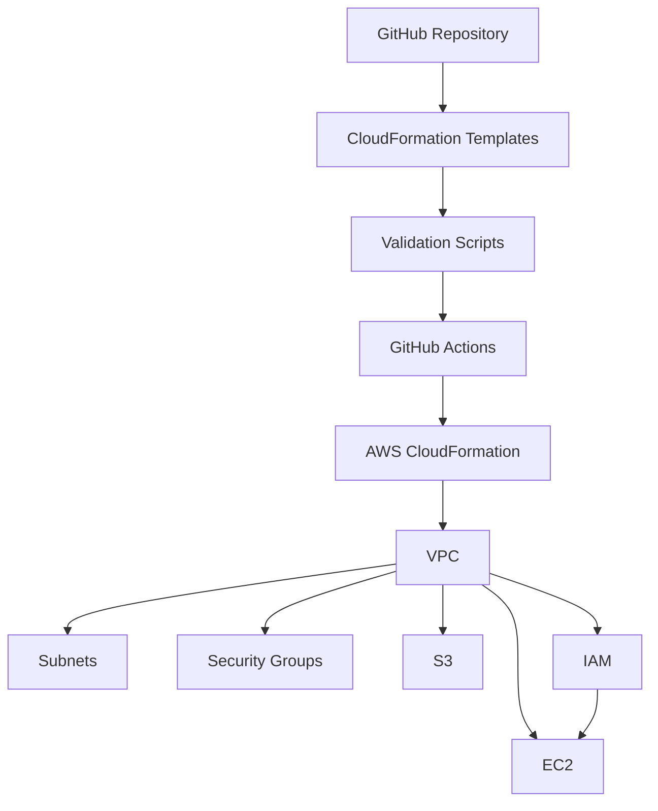
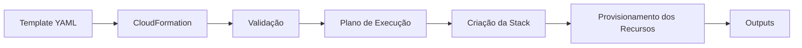
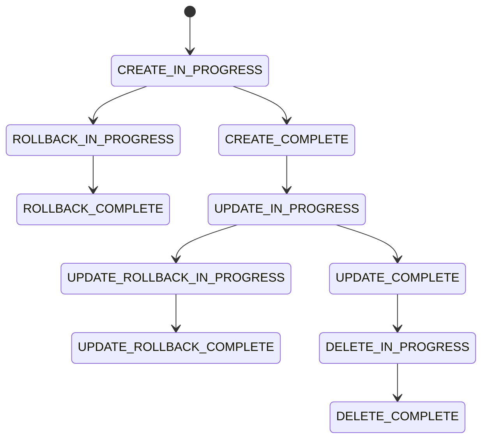
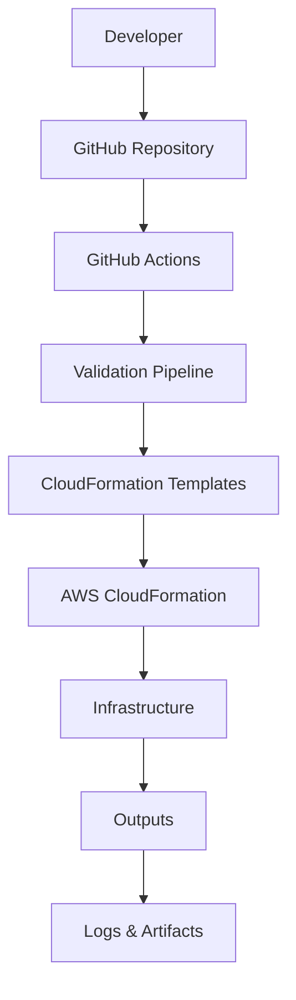
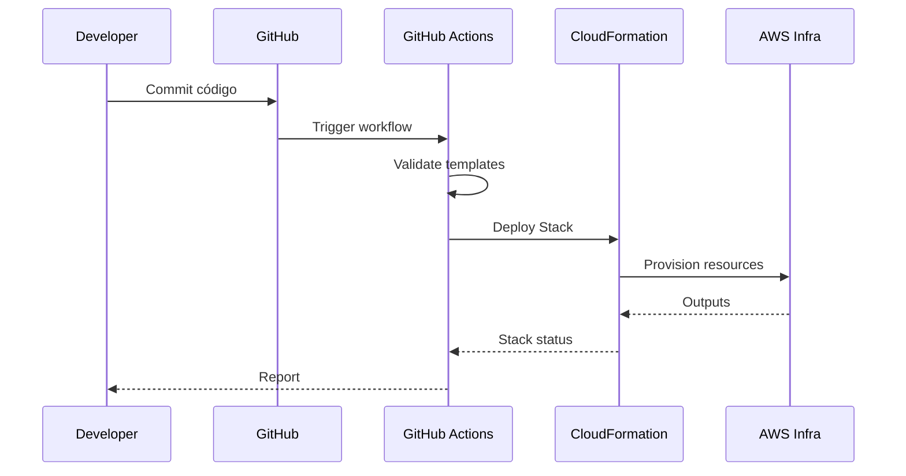

# Introdução

## Bem-vindo ao laboratório

Seja bem-vindo ao projeto **Implementando Infraestrutura Automatizada com AWS CloudFormation**.

Este repositório foi desenvolvido para demonstrar como aplicar os princípios de **Infrastructure as Code (IaC)** na Amazon Web Services (AWS), automatizando o provisionamento de infraestrutura de forma segura, reproduzível e escalável.

Mais do que apresentar templates do CloudFormation, este laboratório busca reproduzir práticas utilizadas por equipes de engenharia de plataforma (Platform Engineering), Cloud Engineering e DevOps em ambientes corporativos.

---

# O problema

Durante muitos anos, a criação de infraestrutura em nuvem foi realizada manualmente.

O processo normalmente envolvia:

- criação manual de VPCs;
- configuração de sub-redes;
- criação de Security Groups;
- provisionamento de instâncias EC2;
- configuração de buckets S3;
- definição de permissões IAM;
- configuração de rotas e gateways.

Embora funcional para ambientes pequenos, essa abordagem apresenta diversos desafios:

- erros humanos;
- inconsistência entre ambientes;
- dificuldade de auditoria;
- baixa rastreabilidade;
- tempo elevado para provisionamento;
- dificuldade para reproduzir ambientes.

À medida que a infraestrutura cresce, esses problemas aumentam significativamente.

---

# A solução

Infrastructure as Code (IaC) propõe uma mudança de paradigma.

Em vez de criar recursos manualmente, toda a infraestrutura passa a ser descrita em arquivos de texto versionados.

Esses arquivos definem exatamente quais recursos devem existir, suas configurações e seus relacionamentos.

Com essa abordagem, a infraestrutura torna-se:

- reproduzível;
- previsível;
- auditável;
- reutilizável;
- automatizável.

Na AWS, o principal serviço para implementar essa estratégia é o **AWS CloudFormation**.

---

# Objetivos deste projeto

Este laboratório possui diversos objetivos técnicos.

Entre eles:

- aprender Infrastructure as Code;

- compreender o funcionamento do AWS CloudFormation;

- construir templates reutilizáveis;

- automatizar o deployment da infraestrutura;

- validar templates antes do provisionamento;

- aplicar boas práticas de engenharia;

- documentar todas as decisões técnicas;

- estruturar um projeto profissional para portfólio.

---

# Público-alvo

Este material foi desenvolvido para:

- estudantes de computação;

- profissionais iniciando em Cloud Computing;

- engenheiros DevOps;

- Cloud Engineers;

- profissionais de infraestrutura;

- administradores de sistemas;

- arquitetos de soluções;

- candidatos a certificações AWS.

Também pode ser utilizado como material de consulta por profissionais experientes.

---

# O que será construído

Ao longo deste laboratório será criada uma infraestrutura completa utilizando AWS CloudFormation.

Entre os componentes desenvolvidos estão:

- Amazon VPC;

- Sub-redes públicas;

- Internet Gateway;

- Route Tables;

- Security Groups;

- IAM Roles;

- IAM Policies;

- Amazon EC2;

- Amazon S3;

- Outputs;

- Exports;

- Scripts Bash;

- GitHub Actions.

Todo o ambiente poderá ser criado ou removido utilizando apenas alguns comandos.

---

# Arquitetura Geral



---

# Visão do projeto

O repositório foi organizado para representar um projeto real de engenharia de infraestrutura.

A estrutura prioriza:

- organização;
- modularização;
- documentação;
- reutilização;
- automação;
- facilidade de manutenção.

Cada diretório possui uma responsabilidade específica, facilitando tanto o aprendizado quanto a evolução do projeto.

---

# Filosofia adotada

Este laboratório foi desenvolvido seguindo alguns princípios fundamentais.

## Automatizar sempre

Tudo aquilo que puder ser automatizado deve ser automatizado.

A automação reduz erros humanos, aumenta a produtividade e garante consistência entre ambientes.

## Versionar tudo

Toda alteração na infraestrutura deve passar pelo controle de versão.

Isso permite rastrear mudanças, revisar histórico e colaborar em equipe.

## Validar antes de implantar

Nenhum template deve ser implantado sem validação prévia.

Por esse motivo, o projeto inclui scripts e workflows específicos para validar templates, scripts e estrutura do repositório.

---

## Próxima seção

Na próxima parte serão apresentados os conceitos fundamentais de **Infrastructure as Code**, a arquitetura do **AWS CloudFormation**, os elementos que compõem um template e como esses componentes trabalham juntos para automatizar o provisionamento da infraestrutura.

---

---

# Infrastructure as Code (IaC)

## O que é Infrastructure as Code?

Infrastructure as Code (IaC) é a prática de definir, provisionar e gerenciar infraestrutura utilizando código em vez de processos manuais.

Em vez de acessar o console da AWS e criar recursos um a um, toda a infraestrutura é descrita em arquivos de configuração que podem ser versionados, revisados e executados automaticamente.

Essa abordagem aproxima a gestão da infraestrutura das boas práticas já consolidadas no desenvolvimento de software, como controle de versão, revisão por pares, automação e integração contínua.

---

## Por que utilizar IaC?

A adoção de IaC traz diversos benefícios para equipes e organizações:

- **Consistência:** ambientes de desenvolvimento, homologação e produção podem ser criados com a mesma configuração.
- **Reprodutibilidade:** um ambiente pode ser recriado sempre que necessário.
- **Automação:** reduz tarefas repetitivas e minimiza intervenção manual.
- **Auditoria:** todas as alterações ficam registradas no histórico do repositório.
- **Escalabilidade:** facilita a criação de múltiplos ambientes com pequenas alterações de parâmetros.
- **Recuperação:** em caso de falha, a infraestrutura pode ser recriada rapidamente.

---

# O que é o AWS CloudFormation?

O AWS CloudFormation é o serviço da AWS responsável por implementar Infrastructure as Code de forma nativa.

Com ele, é possível descrever toda a infraestrutura em arquivos YAML ou JSON chamados **templates**.

Esses templates definem:

- recursos;
- propriedades;
- dependências;
- parâmetros;
- saídas (Outputs).

Quando um template é executado, o CloudFormation cria uma **Stack**, responsável por provisionar e gerenciar todos os recursos descritos.

---

# Como o CloudFormation funciona?

O processo de provisionamento pode ser resumido da seguinte forma:



O CloudFormation analisa o template, identifica dependências entre recursos e executa as operações na ordem correta.

Caso ocorra algum erro durante a criação, o serviço pode realizar **rollback automático**, retornando o ambiente ao estado anterior.

---

# Componentes de um Template

Um template CloudFormation é composto por diferentes seções, cada uma com uma responsabilidade específica.

## Parameters

Permitem personalizar o comportamento do template sem alterar o código.

Exemplos:

- nome da Stack;
- tipo de instância EC2;
- CIDR da VPC;
- região de implantação.

---

## Mappings

São tabelas de consulta utilizadas para selecionar valores conforme uma condição.

Um exemplo comum é escolher diferentes AMIs de acordo com a região da AWS.

---

## Conditions

Permitem criar recursos ou aplicar propriedades apenas quando determinadas condições forem atendidas.

Isso torna os templates mais flexíveis e reutilizáveis.

---

## Resources

É a seção principal do template.

Nela são definidos todos os recursos que serão criados, como:

- VPC;
- Subnets;
- Internet Gateway;
- Route Tables;
- Security Groups;
- EC2;
- IAM Roles;
- Buckets S3.

---

## Outputs

Os Outputs expõem informações importantes após a criação da Stack.

Exemplos:

- ID da VPC;
- ID da instância EC2;
- nome do bucket S3;
- IP público da instância;
- ARN de recursos.

Essas informações podem ser utilizadas por outras Stacks ou por pipelines de automação.

---

# O conceito de Stack

Uma **Stack** representa uma instância em execução de um template CloudFormation.

Ela agrupa todos os recursos relacionados a uma determinada infraestrutura.

Isso permite:

- criar;
- atualizar;
- excluir;
- monitorar;

toda a infraestrutura como uma única unidade lógica.

---

# Ciclo de vida de uma Stack



Esse gerenciamento automático do ciclo de vida é um dos grandes diferenciais do CloudFormation, pois reduz riscos durante atualizações e facilita a recuperação em caso de falhas.

---

# Provisionamento Manual x Infrastructure as Code

| Provisionamento Manual | Infrastructure as Code |
|-------------------------|------------------------|
| Configuração via Console | Configuração por código |
| Suscetível a erros humanos | Processo reproduzível |
| Difícil de auditar | Totalmente versionável |
| Alterações manuais | Alterações controladas |
| Baixa automação | Automação completa |
| Difícil replicação | Replicação simples |
| Documentação separada | Código como documentação |

---

## Próxima seção

Na próxima parte conheceremos a arquitetura do laboratório, a organização do repositório, o papel de cada diretório e como templates, scripts e workflows trabalham em conjunto para automatizar todo o ciclo de vida da infraestrutura.


---


---

# Arquitetura do Laboratório

## Visão geral da solução

Este laboratório foi projetado para simular um ambiente real de engenharia de infraestrutura em nuvem, utilizando AWS CloudFormation como base principal de automação.

A arquitetura foi pensada para ser:

- modular;
- escalável;
- auditável;
- automatizável;
- reproduzível.

---

## Estrutura do repositório

O repositório segue uma organização orientada a responsabilidades:

```
.
├── templates/
├── scripts/
├── docs/
├── .github/
│   └── workflows/
└── README.md
```

Cada diretório possui um papel específico dentro do ecossistema de automação.

---

## Diretório templates/

Contém todos os arquivos CloudFormation responsáveis pela definição da infraestrutura.

Exemplos:

- VPC
- Subnets
- EC2
- IAM Roles
- Security Groups
- S3 Buckets

Esses templates são escritos em YAML e representam a **fonte única da verdade (Single Source of Truth)** da infraestrutura.

---

## Diretório scripts/

Contém scripts Bash responsáveis por automatizar tarefas operacionais, como:

- validação de templates;
- deploy da infraestrutura;
- destruição da Stack;
- execução de verificações locais;
- padronização de comandos AWS CLI.

Esses scripts permitem executar o ciclo completo da infraestrutura fora do GitHub Actions, garantindo portabilidade.

---

## Diretório docs/

Contém a documentação técnica do projeto.

O objetivo é transformar o repositório em um material educacional e profissional, facilitando:

- entendimento da arquitetura;
- onboarding de novos engenheiros;
- explicação de decisões técnicas;
- uso como portfólio.

---

## Diretório .github/workflows/

Contém os pipelines de automação do GitHub Actions.

Esses workflows implementam:

- validação de templates;
- análise de qualidade de código;
- deploy automatizado;
- geração de relatórios;
- publicação de artefatos.

---

# Fluxo da solução

A arquitetura segue um fluxo contínuo de automação:



---

# Ciclo de vida da infraestrutura

O ciclo completo da infraestrutura pode ser descrito em quatro fases principais:

## 1. Desenvolvimento

O engenheiro define ou altera templates no diretório `templates/`.

---

## 2. Validação

O pipeline executa verificações automáticas:

- YAML syntax check
- cfn-lint
- ShellCheck
- validate.sh
- AWS validate-template

---

## 3. Deploy

Após validação:

- a Stack é criada ou atualizada;
- recursos são provisionados;
- dependências são resolvidas automaticamente;
- outputs são gerados.

---

## 4. Monitoramento e remoção

O sistema permite:

- acompanhar eventos da Stack;
- visualizar logs;
- exportar outputs;
- destruir a infraestrutura quando necessário.

---

# Integração entre componentes

A força deste laboratório está na integração entre suas partes:

## Templates

Definem a infraestrutura.

## Scripts

Automatizam operações locais.

## GitHub Actions

Executam validações e deploys automatizados.

## AWS CloudFormation

Executa o provisionamento real da infraestrutura.

---

# Exemplo de fluxo completo



---

# Características da arquitetura

Esta solução foi projetada com foco em princípios modernos de engenharia:

- **Infrastructure as Code (IaC)**
- **Automação total**
- **Separação de responsabilidades**
- **Reprodutibilidade**
- **Escalabilidade**
- **Observabilidade**
- **Segurança por design**

---

## Próxima seção

Na próxima parte serão detalhadas as boas práticas adotadas no projeto, incluindo princípios do AWS Well-Architected Framework, segurança, modularização, observabilidade e otimização de custos. 

---

---

# Boas práticas de engenharia

## Visão geral

A construção de infraestrutura em nuvem não deve se limitar ao funcionamento técnico.

Ela precisa seguir princípios de:

- segurança;
- confiabilidade;
- eficiência;
- escalabilidade;
- rastreabilidade;
- governança.

Este laboratório aplica boas práticas inspiradas no **AWS Well-Architected Framework** e em experiências reais de engenharia de plataforma.

---

# AWS Well-Architected Framework

O AWS Well-Architected Framework é um conjunto de princípios que orienta a construção de sistemas seguros, resilientes e eficientes na nuvem.

Ele é dividido em cinco pilares principais:

---

## 1. Excelência operacional

Refere-se à capacidade de executar e monitorar sistemas de forma eficiente.

Neste projeto isso é aplicado através de:

- logs estruturados nos scripts;
- GitHub Actions com step summary;
- validações automáticas;
- scripts reutilizáveis;
- padronização de processos.

---

## 2. Segurança

Segurança é aplicada em múltiplas camadas:

- uso de IAM Roles em vez de credenciais fixas;
- princípio do menor privilégio;
- validação de templates antes do deploy;
- separação de ambientes;
- não versionamento de segredos (`.env`, `.pem`, etc).

---

## 3. Confiabilidade

A infraestrutura deve ser capaz de se recuperar de falhas.

Este projeto implementa:

- rollback automático do CloudFormation;
- validação pré-deploy;
- execução idempotente de templates;
- monitoramento de status da Stack.

---

## 4. Eficiência de performance

A infraestrutura é projetada para ser eficiente desde o início:

- uso de templates reutilizáveis;
- criação sob demanda;
- eliminação de recursos manuais;
- automação via CI/CD.

---

## 5. Otimização de custos

A arquitetura busca evitar desperdícios:

- criação sob demanda via deploy;
- remoção automatizada via scripts;
- possibilidade de destruição completa da Stack;
- uso de infraestrutura efêmera para testes.

---

# Modularização da infraestrutura

Um dos principais conceitos aplicados neste laboratório é a modularização.

Cada componente da infraestrutura é separado em templates específicos:

- VPC
- EC2
- IAM
- S3
- Security Groups

Isso permite:

- reutilização de código;
- manutenção simplificada;
- testes isolados;
- evolução incremental.

---

# Observabilidade

Observabilidade é a capacidade de entender o comportamento do sistema em execução.

Este projeto implementa:

- logs estruturados em scripts Bash;
- artefatos de execução no GitHub Actions;
- outputs da Stack exportados;
- eventos do CloudFormation armazenados;
- step summary automatizado.

---

# Segurança operacional

Além da segurança técnica, existe também a segurança operacional:

- validação antes de deploy;
- execução controlada via workflows;
- revisão de código via Git;
- separação entre validação e deploy;
- execução manual em ambientes sensíveis.

---

# Versionamento como base da infraestrutura

Todo o projeto é baseado no conceito de que:

> A infraestrutura é código, e o código deve ser versionado.

Isso permite:

- rastrear mudanças;
- reverter alterações;
- colaborar em equipe;
- manter histórico de decisões.

---

# Automação como princípio central

A automação é um dos pilares mais importantes deste projeto.

Tudo o que pode ser automatizado foi automatizado:

- validação de templates;
- deploy de infraestrutura;
- destruição de ambientes;
- geração de relatórios;
- análise de scripts.

---

# Benefícios da abordagem adotada

A combinação de boas práticas resulta em:

- redução de erros humanos;
- aumento da confiabilidade;
- padronização de ambientes;
- maior velocidade de entrega;
- facilidade de manutenção;
- clareza arquitetural.

---

## Próxima seção

Na última parte deste documento serão apresentados:

- conclusões do projeto;
- aprendizados técnicos;
- próximos passos de evolução;
- referências utilizadas;
- glossário de termos;
- e uma visão de carreira para profissionais de Cloud e DevOps.


---

---

# Conclusão e visão geral do projeto

## O que foi construído

Ao longo deste laboratório foi desenvolvida uma infraestrutura completa em AWS utilizando **CloudFormation como base de Infrastructure as Code (IaC)**.

O projeto integra:

- templates CloudFormation;
- scripts Bash automatizados;
- pipelines de CI/CD com GitHub Actions;
- validações de qualidade;
- documentação técnica estruturada;
- automação de deploy e teardown.

Mais do que um conjunto de arquivos, este projeto representa um **ciclo completo de engenharia de infraestrutura moderna**.

---

# Aprendizados técnicos

A construção deste laboratório permite consolidar conhecimentos fundamentais em Cloud Computing e DevOps.

## Infrastructure as Code

A infraestrutura deixa de ser manual e passa a ser tratada como código versionado, auditável e automatizável.

---

## AWS CloudFormation

Foi possível compreender:

- estrutura de templates YAML;
- ciclo de vida de uma Stack;
- dependências entre recursos;
- uso de Outputs e Exports;
- validação e rollback automático.

---

## Automação com GitHub Actions

O pipeline implementado demonstra:

- validação automática de código;
- execução de scripts de verificação;
- integração com AWS via OIDC;
- geração de relatórios;
- publicação de artefatos.

---

## Engenharia de qualidade

O projeto incorpora práticas de qualidade como:

- lint de templates (`cfn-lint`);
- validação de YAML;
- análise de scripts (`ShellCheck`);
- verificação pré-deploy;
- fail fast em pipelines.

---

# Próximos passos de evolução

Este laboratório pode ser evoluído para um nível ainda mais avançado com a inclusão de novas ferramentas e práticas:

## Segurança avançada

- AWS Config Rules
- AWS Security Hub
- Checkov
- Trivy
- cfn-guard

---

## Testes automatizados de infraestrutura

- TaskCat (AWS)
- testes de integração pós-deploy
- validação de compliance

---

## CI/CD avançado

- ambientes efêmeros para Pull Requests
- deploy automatizado em múltiplos ambientes
- aprovação manual para produção
- rollback automático

---

## Observabilidade

- integração com Amazon CloudWatch Logs
- métricas personalizadas
- alertas via Amazon SNS
- dashboards no CloudWatch

---

## Arquitetura de produção

- separação multi-conta AWS
- uso de AWS Organizations
- pipelines segregados por ambiente
- controle de acesso baseado em função

---

# Impacto profissional

Este tipo de projeto tem impacto direto na evolução de carreira em tecnologia.

Ele demonstra habilidades essenciais para funções como:

- Cloud Engineer;
- DevOps Engineer;
- Platform Engineer;
- SRE (Site Reliability Engineer);
- Arquiteto de Soluções AWS.

---

# Relevância para o mercado

Empresas modernas buscam profissionais que:

- automatizam infraestrutura;
- entendem Cloud profundamente;
- trabalham com IaC;
- implementam CI/CD;
- documentam decisões técnicas;
- pensam em escala e confiabilidade.

Este projeto simula exatamente esse cenário.

---

# Visão de carreira

Dominar Infrastructure as Code não é apenas uma habilidade técnica.

É um diferencial estratégico.

Profissionais que dominam esse tipo de abordagem conseguem:

- reduzir tempo de entrega;
- aumentar confiabilidade de sistemas;
- reduzir custos operacionais;
- atuar em ambientes críticos;
- participar de decisões arquiteturais.

---

# Considerações finais

Este laboratório representa uma jornada completa de aprendizado em Cloud Computing.

Ele conecta:

- teoria;
- prática;
- automação;
- arquitetura;
- e boas práticas de engenharia.

Mais importante do que os recursos criados é a **forma como eles foram concebidos, organizados e automatizados**.

---

## Encerramento

A infraestrutura apresentada aqui pode ser facilmente estendida, adaptada e aplicada em cenários reais de produção.

O objetivo final não é apenas criar recursos na AWS, mas sim demonstrar capacidade de:

- projetar sistemas;
- automatizar processos;
- documentar decisões;
- e operar infraestrutura em escala.

---

## Fim da introdução

Este documento encerra a introdução ao projeto.

As próximas seções aprofundam detalhes técnicos específicos de implementação e evolução da arquitetura. 


---


---

# Referências técnicas

Este projeto foi construído com base em documentação oficial e boas práticas amplamente adotadas no mercado de Cloud Computing.

## AWS Documentation

- AWS CloudFormation User Guide  
  https://docs.aws.amazon.com/cloudformation/

- AWS Well-Architected Framework  
  https://docs.aws.amazon.com/wellarchitected/

- AWS IAM Best Practices  
  https://docs.aws.amazon.com/IAM/latest/UserGuide/best-practices.html

- Amazon EC2 Documentation  
  https://docs.aws.amazon.com/ec2/

- Amazon VPC Documentation  
  https://docs.aws.amazon.com/vpc/

---

## DevOps e CI/CD

- GitHub Actions Documentation  
  https://docs.github.com/actions

- Infrastructure as Code (IaC) Concepts  
  https://martinfowler.com/bliki/InfrastructureAsCode.html

---

# Glossário

## IaC (Infrastructure as Code)
Prática de gerenciar infraestrutura por meio de código versionado.

---

## CloudFormation
Serviço da AWS que permite provisionar e gerenciar infraestrutura como código.

---

## Stack
Conjunto de recursos AWS criados e gerenciados como uma única unidade no CloudFormation.

---

## Template
Arquivo YAML ou JSON que define a infraestrutura a ser provisionada.

---

## Resource
Qualquer componente AWS definido dentro de um template (EC2, VPC, S3, etc.).

---

## Output
Valores expostos após a criação da Stack, utilizados para integração entre sistemas.

---

## OIDC (OpenID Connect)
Mecanismo de autenticação utilizado para permitir acesso seguro à AWS via GitHub Actions sem uso de credenciais estáticas.

---

## CI/CD
Continuous Integration / Continuous Delivery — prática de automação de build, validação e deploy de software e infraestrutura.

---

# Mensagem final

A construção de infraestrutura em nuvem não é apenas uma atividade técnica.

É uma disciplina que combina:

- engenharia de software;
- arquitetura de sistemas;
- automação;
- segurança;
- e governança.

---

Este projeto demonstrou, de forma prática, como é possível transformar infraestrutura manual em um sistema totalmente automatizado, versionado e auditável.

---

# Evolução contínua

A engenharia de infraestrutura é um campo em constante evolução.

Alguns próximos passos naturais para este projeto incluem:

- adoção de ferramentas de segurança como CodeQL e Checkov;
- testes automatizados de infraestrutura com TaskCat;
- implementação de multi-account AWS;
- uso de pipelines avançados com aprovação manual;
- integração com ferramentas de observabilidade;
- automação de rollback inteligente.

---

# Encerramento do documento

Este documento marca o encerramento da introdução ao projeto.

Ele serve como base conceitual para todos os templates, scripts e pipelines implementados neste repositório.

A partir deste ponto, o foco passa a ser a aplicação prática dos conceitos apresentados.

---

# Autor

**Sérgio Luiz dos Santos**

GitHub:  
https://github.com/Santosdevbjj

---

# Fim da documentação

###############################################################################
#
# Projeto:
# Implementando Infraestrutura Automatizada
# com AWS CloudFormation
#
# Status: COMPLETO
#
############################################################################### 


