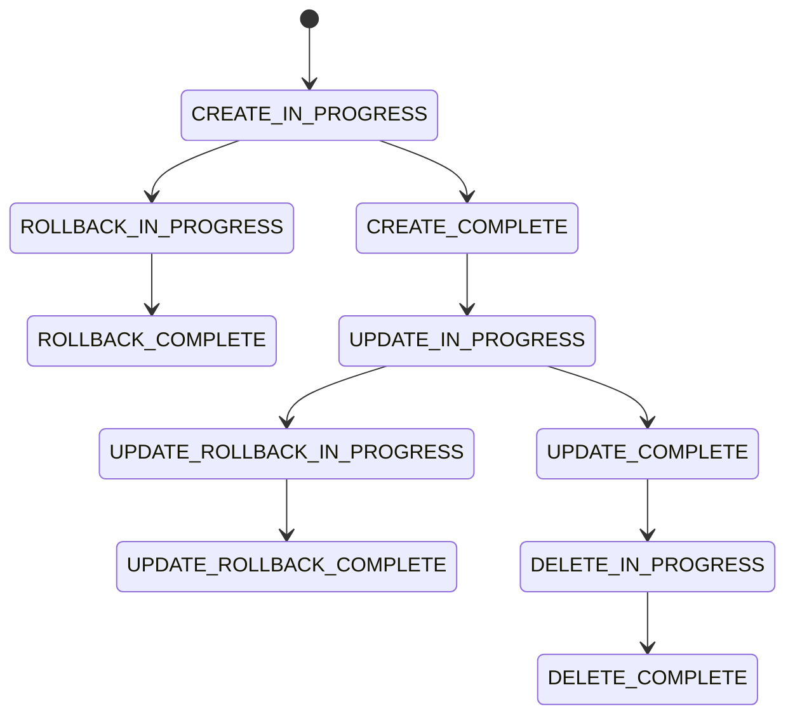

# AWS CloudFormation na prática

## Visão geral

O AWS CloudFormation é o serviço nativo da AWS para **Infrastructure as Code (IaC)**.

Ele permite modelar e provisionar infraestrutura utilizando arquivos declarativos, chamados **templates**, escritos em YAML ou JSON.

Neste projeto, o CloudFormation é o núcleo da automação da infraestrutura.

---

# Por que CloudFormation?

A AWS oferece diversas formas de provisionamento:

- Console (manual)
- AWS CLI (imperativo)
- SDKs (programático)
- CloudFormation (declarativo)

Entre essas opções, o CloudFormation se destaca por:

- consistência;
- automação nativa;
- integração com todos os serviços AWS;
- suporte a rollback automático;
- controle de ciclo de vida da infraestrutura.

---

# Conceito fundamental: infraestrutura declarativa

No CloudFormation, você não descreve **como fazer**, mas sim **o que você quer**.

Exemplo:

❌ Imperativo:
- criar VPC
- criar subnet
- criar EC2

✅ Declarativo:
- defina VPC + subnet + EC2 em um template
- AWS resolve a ordem de criação

---

# Estrutura de um template

Um template CloudFormation segue uma estrutura padrão:

```yaml
AWSTemplateFormatVersion: '2010-09-09'

Description: String

Parameters:
  ...

Mappings:
  ...

Conditions:
  ...

Resources:
  ...

Outputs:
  ...
```

---

# Seções principais

## Parameters

Permitem tornar o template dinâmico.

Exemplo:

- tipo de instância EC2
- CIDR da VPC
- nome da Stack
- ambiente (dev, prod)

---

## Mappings

Estruturas estáticas de chave-valor.

Usadas para:

- mapear regiões AWS para AMIs
- configurar variáveis por ambiente
- centralizar decisões simples

---

## Conditions

Permitem criar lógica condicional.

Exemplo:

- criar recursos apenas em produção
- habilitar features específicas por ambiente

---

## Resources (núcleo do template)

É a seção mais importante.

Define todos os recursos AWS.

Exemplos:

- AWS::EC2::Instance
- AWS::EC2::VPC
- AWS::S3::Bucket
- AWS::IAM::Role
- AWS::EC2::SecurityGroup

---

## Outputs

Permite expor informações após a criação da Stack.

Exemplos:

- IP público da EC2
- ID da VPC
- ARN de recursos
- nome de buckets

---

# Stack no CloudFormation

Uma Stack representa uma **instância de execução de um template**.

Quando você cria uma Stack:

- o template é interpretado;
- recursos são provisionados;
- dependências são resolvidas automaticamente;
- outputs são gerados;
- estado da infraestrutura é gerenciado.

---

# Ciclo de vida da Stack



---

# Dependências entre recursos

O CloudFormation gerencia automaticamente dependências.

Exemplo:

- EC2 depende da Security Group
- Security Group depende da VPC
- Subnet depende da VPC

Isso é resolvido via:

- referências diretas (`Ref`)
- funções intrínsecas (`Fn::GetAtt`, `Fn::Join`)

---

# Funções intrínsecas

## Ref

Usada para referenciar recursos ou parâmetros.

```yaml
!Ref MyVPC
```

---

## GetAtt

Usada para obter atributos de um recurso.

```yaml
!GetAtt MyInstance.PublicIp
```

---

## Join

Concatena strings.

```yaml
!Join [ "-", [ "dev", "vpc" ] ]
```

---

## Sub

Substituição de variáveis.

```yaml
!Sub "Instance-${Environment}"
```

---

# CloudFormation e segurança

Boas práticas incluem:

- uso de IAM Roles ao invés de chaves fixas
- mínimo privilégio
- validação antes de deploy
- uso de OIDC em pipelines
- controle de mudanças via Git

---

# Validação de templates

Antes do deploy, os templates devem ser validados:

## Ferramentas utilizadas no projeto:

- cfn-lint
- aws cloudformation validate-template
- yq (validação YAML)
- scripts de validação customizados

---

# Deploy de infraestrutura

O deploy pode ocorrer via:

## AWS CLI

```bash
aws cloudformation deploy \
  --template-file template.yaml \
  --stack-name my-stack
```

---

## GitHub Actions

Automatizando:

- validação
- deploy
- monitoramento
- logs
- outputs

---

# Atualização de Stack

O CloudFormation permite:

- update incremental
- change sets
- rollback automático em falha

---

# Remoção de infraestrutura

A Stack pode ser removida completamente:

```bash
aws cloudformation delete-stack
```

Isso garante:

- limpeza total de recursos
- controle de custos
- ambientes efêmeros

---

# Benefícios do CloudFormation

## Padronização

Infraestrutura sempre segue o mesmo modelo.

---

## Automação

Provisionamento sem intervenção manual.

---

## Segurança

Controle centralizado e auditável.

---

## Reprodutibilidade

Ambientes idênticos em qualquer região ou conta.

---

## Escalabilidade

Facilidade para replicar infraestrutura.

---

# CloudFormation vs Terraform

| CloudFormation | Terraform |
|----------------|----------|
| AWS nativo | Multi-cloud |
| YAML/JSON | HCL |
| Estado gerenciado pela AWS | Estado local/remoto |
| Integração profunda AWS | Flexível |

---

# Conclusão

O AWS CloudFormation é uma peça central na construção de arquiteturas modernas na AWS.

Quando combinado com:

- GitHub Actions
- scripts de automação
- boas práticas de DevOps

ele permite criar pipelines completos de infraestrutura como código.

---

# Próximo documento

O próximo arquivo abordará:

- benefícios da adoção de CloudFormation
- impacto em ambientes reais
- ganhos operacionais e estratégicos
- comparação com abordagens tradicionais
