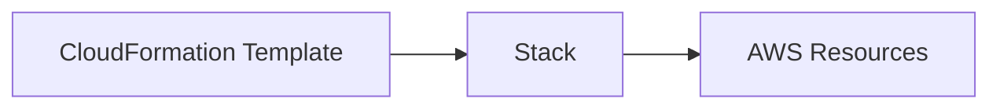
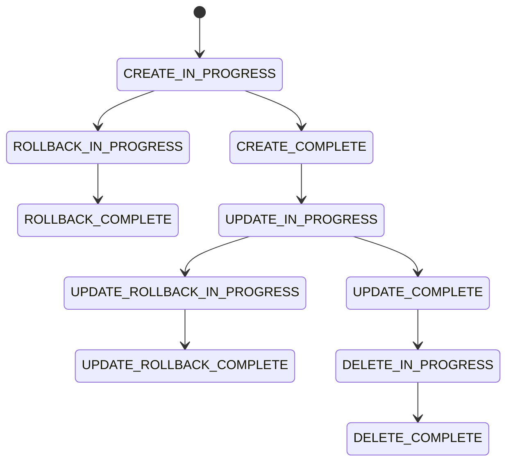

# AWS CloudFormation Stack

## Visão geral

No AWS CloudFormation, uma **Stack** é a unidade fundamental de execução e gerenciamento da infraestrutura.

Ela representa um conjunto de recursos AWS criados, atualizados e excluídos como uma única entidade lógica.

Em outras palavras:

> Uma Stack é a materialização de um template CloudFormation em execução na AWS.

---

# Relação entre Template e Stack

Existe uma relação direta entre os dois conceitos:

- **Template**: definição da infraestrutura (código)
- **Stack**: instância da infraestrutura (execução)



---

# Ciclo de vida de uma Stack

Uma Stack passa por diferentes estados ao longo de sua existência.

## Estados principais

- CREATE_IN_PROGRESS
- CREATE_COMPLETE
- UPDATE_IN_PROGRESS
- UPDATE_COMPLETE
- DELETE_IN_PROGRESS
- DELETE_COMPLETE
- ROLLBACK_IN_PROGRESS

---

## Fluxo completo



---

# Como uma Stack funciona internamente

Quando uma Stack é criada:

1. O template é enviado para o CloudFormation
2. O serviço analisa dependências entre recursos
3. Um plano de execução é gerado automaticamente
4. Recursos são provisionados na ordem correta
5. Outputs são gerados
6. O estado da Stack é armazenado

---

# Dependências entre recursos

O CloudFormation resolve automaticamente dependências usando:

- `Ref`
- `Fn::GetAtt`
- relações implícitas

Exemplo:

- EC2 depende de Security Group
- Security Group depende de VPC

O CloudFormation garante a ordem correta de criação.

---

# Tipos de Stack

## 1. Standalone Stack

Stack independente, sem dependência de outras Stacks.

---

## 2. Nested Stack

Stack que contém outras Stacks dentro dela.

Usada para modularização de infraestrutura.

---

## 3. Cross-stack references

Permite compartilhar outputs entre diferentes Stacks.

Exemplo:

- VPC Stack exporta VPC ID
- EC2 Stack importa VPC ID

---

# Stack Outputs

Outputs são valores expostos após a criação da Stack.

Exemplos:

- IP público de uma instância
- ID de VPC
- ARN de recursos
- nome de bucket S3

---

## Exemplo:

```yaml
Outputs:
  InstancePublicIP:
    Value: !GetAtt MyInstance.PublicIp
    Description: IP público da instância EC2
```

---

# Stack Parameters

Stacks podem ser parametrizadas para reutilização.

Exemplo:

- ambiente (dev, prod)
- tipo de instância
- CIDR da VPC

---

## Exemplo:

```yaml
Parameters:
  Environment:
    Type: String
    Default: dev
```

---

# Stack Policy

Permite controlar quais recursos podem ser atualizados.

Usado para:

- proteger recursos críticos
- evitar alterações acidentais
- garantir segurança em produção

---

# Stack Drift

Drift ocorre quando recursos foram modificados fora do CloudFormation.

Exemplo:

- alteração manual no console AWS
- modificação via CLI externa

Isso causa inconsistência entre:

- template
- infraestrutura real

---

# Detecção de Drift

CloudFormation permite detectar drift:

- compara estado atual vs template
- identifica mudanças não controladas

---

# Rollback automático

Se uma Stack falhar durante a criação ou atualização:

- CloudFormation desfaz todas as alterações
- retorna ao estado anterior
- evita infraestrutura parcialmente criada

---

# Benefícios da Stack

## 1. Gerenciamento unificado

Todos os recursos são gerenciados como uma única unidade.

---

## 2. Controle de ciclo de vida

Criação, atualização e remoção centralizadas.

---

## 3. Segurança operacional

Rollback automático reduz riscos.

---

## 4. Reprodutibilidade

Stacks podem ser recriadas em qualquer ambiente.

---

## 5. Automação

Integração direta com CI/CD pipelines.

---

# Stack no contexto deste projeto

Neste laboratório, cada Stack representa um ambiente completo:

- VPC
- Subnets
- EC2
- IAM Roles
- Security Groups

---

O objetivo é demonstrar um ambiente realista de:

- provisionamento automatizado
- infraestrutura modular
- ciclo completo de vida

---

# Conclusão

A Stack é o elemento central do AWS CloudFormation.

Ela conecta:

- templates
- recursos AWS
- automação
- ciclo de vida da infraestrutura

---

Sem Stack, CloudFormation não existe na prática.

---

# Próximo passo

O próximo documento abordará:

- parâmetros avançados de templates
- boas práticas de estruturação
- modularização de infraestrutura
- padrões utilizados em ambientes corporativos
