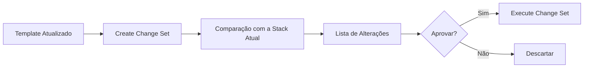

# AWS CloudFormation Change Sets

## Visão geral

À medida que a infraestrutura evolui, novas funcionalidades são adicionadas, recursos são modificados e configurações precisam ser atualizadas. Em ambientes de produção, aplicar essas mudanças diretamente pode representar riscos significativos.

Para minimizar esses riscos, o AWS CloudFormation oferece o recurso **Change Sets**.

Um Change Set permite visualizar todas as alterações que serão realizadas em uma Stack **antes** da execução efetiva da atualização.

Em outras palavras:

> Um Change Set funciona como um plano de execução (execution plan) da infraestrutura.

---

# Por que utilizar Change Sets?

Imagine que uma alteração aparentemente simples em um template possa resultar na substituição de uma instância EC2, na recriação de uma VPC ou até na exclusão de um bucket S3.

Sem uma análise prévia, essas mudanças podem causar indisponibilidade e perda de dados.

Os Change Sets permitem:

- visualizar alterações antes da execução;
- identificar recursos que serão criados;
- identificar recursos que serão modificados;
- identificar recursos que serão substituídos;
- identificar recursos que serão removidos;
- revisar impactos antes da aprovação.

---

# Fluxo de funcionamento



---

# Ciclo de vida de um Change Set

1. Atualizar o template.
2. Criar o Change Set.
3. CloudFormation compara o template com a Stack existente.
4. Gera um relatório das diferenças.
5. O engenheiro revisa as alterações.
6. O Change Set é aprovado ou descartado.
7. Caso aprovado, a atualização é executada.

---

# Tipos de alterações

## Add

Criação de novos recursos.

Exemplo:

- novo bucket S3;
- nova subnet;
- nova IAM Role.

---

## Modify

Alteração de propriedades de um recurso existente.

Exemplo:

- alteração do tipo da instância EC2;
- inclusão de novas tags;
- modificação de regras de Security Group.

---

## Remove

Exclusão de recursos.

Exemplo:

- remoção de um bucket;
- exclusão de uma Route Table.

---

## Replace

Algumas alterações exigem que o recurso seja recriado.

Exemplos:

- alteração do CIDR de uma VPC;
- mudança de determinadas propriedades imutáveis.

Esse tipo de alteração merece atenção especial, pois pode gerar indisponibilidade.

---

# Exemplo de fluxo

## Infraestrutura atual

```
VPC

├── Public Subnet

├── EC2

└── Security Group
```

---

## Alteração proposta

Adicionar:

- Bucket S3
- IAM Role

Resultado do Change Set:

```
+ AWS::S3::Bucket

+ AWS::IAM::Role

= EC2 (sem alterações)

= VPC (sem alterações)
```

---

# Benefícios

## Segurança

Permite revisar alterações antes da execução.

---

## Governança

Facilita processos de aprovação.

---

## Auditoria

Todas as mudanças podem ser documentadas.

---

## Transparência

Toda a equipe consegue entender exatamente o impacto da atualização.

---

# Uso em pipelines CI/CD

Em ambientes corporativos, o fluxo normalmente é:

```mermaid
flowchart TD

Commit

--> Pipeline

--> Validate Template

--> Create Change Set

--> Aprovação Manual

--> Execute Change Set

--> Monitoramento
```

Essa abordagem reduz significativamente o risco de alterações inesperadas em produção.

---

# Comandos AWS CLI

## Criar um Change Set

```bash
aws cloudformation create-change-set \
  --stack-name my-stack \
  --template-body file://template.yaml \
  --change-set-name update-v1
```

---

## Listar Change Sets

```bash
aws cloudformation list-change-sets \
  --stack-name my-stack
```

---

## Descrever um Change Set

```bash
aws cloudformation describe-change-set \
  --stack-name my-stack \
  --change-set-name update-v1
```

---

## Executar um Change Set

```bash
aws cloudformation execute-change-set \
  --stack-name my-stack \
  --change-set-name update-v1
```

---

## Excluir um Change Set

```bash
aws cloudformation delete-change-set \
  --stack-name my-stack \
  --change-set-name update-v1
```

---

# Boas práticas

- Sempre validar o template antes de criar o Change Set.
- Revisar cuidadosamente recursos marcados como **Replace**.
- Utilizar aprovação manual para ambientes de produção.
- Versionar templates em Git.
- Documentar alterações significativas.
- Executar testes em ambientes de desenvolvimento antes da produção.

---

# Integração com este projeto

Embora o laboratório utilize principalmente o comando `aws cloudformation deploy`, a arquitetura foi organizada para permitir a inclusão de Change Sets em futuras evoluções do pipeline.

A adoção de Change Sets é um passo natural para ambientes com requisitos mais rigorosos de governança e controle de mudanças.

---

# Comparação

| Deploy Direto | Deploy com Change Set |
|---------------|-----------------------|
| Atualização imediata | Revisão antes da execução |
| Maior risco | Menor risco |
| Sem análise prévia | Impacto conhecido |
| Adequado para laboratórios | Recomendado para produção |

---

# Conclusão

Os Change Sets representam uma camada adicional de segurança no ciclo de vida da infraestrutura.

Eles permitem prever o impacto de uma atualização antes que qualquer recurso seja modificado, reduzindo riscos e aumentando a confiabilidade das implantações.

Por esse motivo, seu uso é amplamente recomendado em ambientes corporativos e pipelines de CI/CD voltados para produção.

---

# Próximo documento

O próximo documento abordará **Nested Stacks**, explicando como dividir grandes templates em módulos reutilizáveis para construir arquiteturas escaláveis e de fácil manutenção.

---

# Referências

- AWS CloudFormation User Guide
- AWS Well-Architected Framework
- AWS CLI Command Reference

---

**Projeto:** Implementando Infraestrutura Automatizada com AWS CloudFormation

**Autor:** Sérgio Luiz dos Santos

**Status:** Completo
