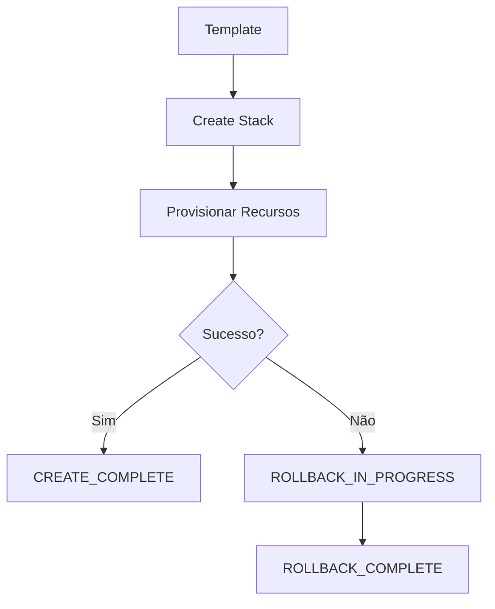

# AWS CloudFormation Rollback

## Visão geral

Em qualquer ambiente de infraestrutura, falhas podem ocorrer durante a criação ou atualização de recursos. Um template pode conter uma configuração inválida, uma dependência pode não ser atendida ou um limite da conta AWS pode ser excedido.

Para evitar que a infraestrutura permaneça em um estado inconsistente, o AWS CloudFormation implementa um mecanismo de **rollback automático**.

O rollback restaura a Stack para o último estado consistente conhecido quando uma operação falha.

> O objetivo é garantir que uma implantação incompleta não deixe recursos parcialmente configurados ou um ambiente instável.

---

# O que é rollback?

Rollback é o processo de desfazer automaticamente as alterações realizadas durante uma operação de criação ou atualização que não foi concluída com sucesso.

Em vez de interromper a execução no ponto da falha, o CloudFormation tenta restaurar a infraestrutura ao estado anterior.

---

# Por que o rollback é importante?

Sem rollback automático, uma falha poderia resultar em:

- recursos criados parcialmente;
- dependências quebradas;
- configurações inconsistentes;
- aumento de custos com recursos esquecidos;
- dificuldade para recuperar o ambiente.

Com rollback, a infraestrutura permanece previsível e consistente.

---

# Fluxo de criação com rollback



---

# Fluxo de atualização

```mermaid
flowchart TD

Template Atualizado

--> Update Stack

--> Aplicar Alterações

--> Verificar Resultado

--> |Sucesso| UPDATE_COMPLETE

--> |Falha| UPDATE_ROLLBACK_IN_PROGRESS

--> UPDATE_ROLLBACK_COMPLETE
```

---

# Estados relacionados ao rollback

Durante o ciclo de vida da Stack, alguns estados indicam operações de recuperação.

## CREATE_FAILED

A criação não pôde ser concluída.

---

## ROLLBACK_IN_PROGRESS

O CloudFormation iniciou o processo de desfazer a criação da Stack.

---

## ROLLBACK_COMPLETE

Todos os recursos criados durante a operação foram removidos e a Stack voltou ao estado consistente.

---

## UPDATE_ROLLBACK_IN_PROGRESS

Uma atualização falhou e o CloudFormation iniciou a restauração da versão anterior.

---

## UPDATE_ROLLBACK_COMPLETE

A Stack foi restaurada para o último estado funcional.

---

# Exemplo prático

Considere a seguinte infraestrutura:

```
VPC
│
├── Public Subnet
│
├── Security Group
│
└── EC2
```

Durante uma atualização, o tipo da instância EC2 é alterado para um valor inválido.

Fluxo:

1. CloudFormation inicia a atualização.
2. A alteração da EC2 falha.
3. O serviço interrompe a operação.
4. O rollback restaura a configuração anterior.
5. A Stack retorna ao estado funcional.

Nenhum recurso permanece parcialmente atualizado.

---

# Situações que podem gerar rollback

Entre as causas mais comuns estão:

- parâmetros inválidos;
- AMI inexistente;
- limites de serviço da AWS atingidos;
- permissões insuficientes em IAM;
- conflitos de dependência;
- propriedades incompatíveis;
- erros de sintaxe identificados apenas na execução.

---

# Como acompanhar o rollback

Durante uma falha, é possível consultar os eventos da Stack.

Exemplo:

```bash
aws cloudformation describe-stack-events \
  --stack-name my-stack
```

Os eventos informam:

- recurso afetado;
- motivo da falha;
- horário;
- estado atual.

---

# Recuperação após rollback

Após a conclusão do rollback, recomenda-se:

1. analisar os eventos da Stack;
2. corrigir o template;
3. validar o template localmente;
4. executar um novo deploy.

Essa abordagem reduz a probabilidade de repetir o mesmo erro.

---

# Rollback e CI/CD

Em pipelines automatizados, o rollback aumenta a confiabilidade do processo de entrega.

Fluxo recomendado:

```mermaid
flowchart LR

Commit

--> Validate Template

--> cfn-lint

--> Deploy

--> Monitoramento

--> |Falha| Rollback

--> Correção

--> Novo Deploy
```

---

# Boas práticas

- Validar todos os templates antes do deploy.
- Utilizar `cfn-lint` para identificar problemas antecipadamente.
- Revisar eventos da Stack sempre que ocorrer um rollback.
- Evitar alterações manuais na infraestrutura.
- Utilizar parâmetros para reduzir mudanças no template.
- Executar testes em ambientes de desenvolvimento antes da produção.

---

# Rollback versus exclusão

É importante diferenciar os conceitos:

| Rollback | Delete Stack |
|-----------|--------------|
| Ocorre automaticamente após falha | É iniciado manualmente ou por automação |
| Restaura o estado anterior | Remove toda a infraestrutura |
| Mantém consistência | Elimina os recursos da Stack |

---

# Vantagens do rollback automático

- Redução de indisponibilidade.
- Maior previsibilidade.
- Recuperação automática.
- Menor risco operacional.
- Menor intervenção manual.
- Facilidade para equipes de operações.

---

# Limitações

Embora seja um recurso poderoso, o rollback não substitui boas práticas de engenharia.

Ele não evita:

- erros de modelagem da arquitetura;
- configurações inseguras;
- custos decorrentes de recursos já utilizados;
- impactos externos causados por integrações.

Por isso, validações e testes continuam sendo essenciais.

---

# Relação com este projeto

Os workflows deste laboratório executam diversas validações antes do deploy, reduzindo significativamente a probabilidade de falhas.

Ainda assim, caso um erro alcance a etapa de provisionamento, o mecanismo de rollback do CloudFormation atua como uma camada adicional de proteção, mantendo a infraestrutura consistente.

---

# Conclusão

O rollback automático é um dos principais diferenciais do AWS CloudFormation.

Ele permite que falhas durante a criação ou atualização da infraestrutura sejam tratadas de forma segura, restaurando a Stack para um estado consistente e reduzindo riscos operacionais.

Combinado com validação prévia, versionamento e pipelines de CI/CD, o rollback contribui para implantações mais confiáveis e previsíveis.

---

# Próximo documento

O próximo documento apresentará **Nested Stacks**, mostrando como dividir grandes templates em módulos reutilizáveis para facilitar manutenção, reutilização e escalabilidade.

---

# Referências

- AWS CloudFormation User Guide
- AWS Well-Architected Framework
- AWS CLI Command Reference

---

**Projeto:** Implementando Infraestrutura Automatizada com AWS CloudFormation

**Autor:** Sérgio Luiz dos Santos

**Status:** Completo
