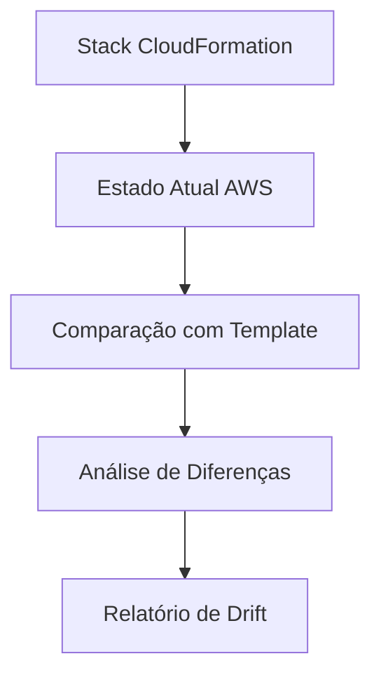

# AWS CloudFormation Drift Detection

## Visão geral

Em ambientes de infraestrutura como código, espera-se que o estado real da infraestrutura seja sempre consistente com o que está definido no template.

No entanto, na prática, isso nem sempre acontece.

Alterações manuais feitas diretamente na AWS Console ou via CLI podem gerar divergências entre:

- o template CloudFormation (fonte de verdade);
- a infraestrutura real em execução.

Esse desvio é chamado de **drift**.

---

# O que é Drift?

Drift ocorre quando recursos gerenciados por uma Stack CloudFormation são modificados fora do controle do CloudFormation.

Em outras palavras:

> A infraestrutura real não corresponde mais ao que está descrito no código.

---

# Exemplo de Drift

Considere a seguinte infraestrutura:

```
VPC
 ├── Subnet Pública
 ├── Security Group
 └── EC2 Instance
```

O template define:

- porta 80 aberta no Security Group

---

## Alteração manual

Um engenheiro acessa o console AWS e adiciona:

- porta 22 (SSH) aberta para o mundo (0.0.0.0/0)

---

## Resultado

Agora existe uma diferença entre:

| Template | Infraestrutura real |
|----------|---------------------|
| Porta 80 | Porta 80 |
| — | Porta 22 aberta |

Isso caracteriza **drift**.

---

# Por que drift é perigoso?

Drift representa um dos maiores riscos em ambientes de produção:

- quebra de segurança;
- comportamento imprevisível;
- dificuldade de auditoria;
- inconsistência entre ambientes;
- perda do controle da infraestrutura como código.

---

# Tipos de drift

## 1. Drift de configuração

Quando propriedades de recursos são alteradas.

Exemplo:

- tipo de instância EC2 modificado manualmente;
- Security Group alterado fora do template.

---

## 2. Drift de recursos

Quando recursos são adicionados ou removidos manualmente.

Exemplo:

- criação manual de uma nova regra de firewall;
- exclusão de um recurso gerenciado pela Stack.

---

## 3. Drift estrutural

Quando a arquitetura diverge do template original.

Exemplo:

- substituição manual de componentes críticos;
- mudanças não versionadas.

---

# Detecção de Drift no CloudFormation

O AWS CloudFormation permite detectar drift automaticamente.

O processo compara:

- estado atual da Stack
- definição do template original

---

# Fluxo de detecção



---

# Como executar drift detection

## Iniciar detecção

```bash
aws cloudformation detect-stack-drift \
  --stack-name my-stack
```

---

## Verificar status

```bash
aws cloudformation describe-stack-drift-detection-status \
  --stack-drift-detection-id <id>
```

---

## Obter resultados

```bash
aws cloudformation describe-stack-resource-drifts \
  --stack-name my-stack
```

---

# Status de drift

## IN_SYNC

A infraestrutura está consistente com o template.

---

## MODIFIED

O recurso foi alterado fora do CloudFormation.

---

## DELETED

O recurso existe no template, mas foi removido manualmente.

---

## NOT_CHECKED

O recurso ainda não foi analisado.

---

# Exemplo de resultado

```
ResourceType: AWS::EC2::SecurityGroup
LogicalResourceId: MySecurityGroup
DriftStatus: MODIFIED
PropertyDifferences:
  - Property: IpPermissions
    Expected: Port 80 only
    Actual: Port 80 + Port 22
```

---

# Impactos do drift

## Segurança

- portas abertas indevidamente;
- permissões excessivas;
- exposição de serviços.

---

## Operação

- comportamento inesperado da aplicação;
- inconsistência entre ambientes;
- falhas difíceis de reproduzir.

---

## Auditoria

- perda de rastreabilidade;
- dificuldade de compliance;
- violação de políticas internas.

---

# Como evitar drift

## 1. Evitar alterações manuais

Toda alteração deve passar pelo CloudFormation.

---

## 2. Usar CI/CD

Alterações devem ser aplicadas via pipeline automatizado.

---

## 3. Revisão de código

Pull Requests devem ser usados para revisar mudanças na infraestrutura.

---

## 4. Controle de acesso

Restringir permissões no console AWS.

---

## 5. Auditoria contínua

Executar drift detection periodicamente.

---

# Drift em ambientes reais

Em empresas maduras, drift é tratado como incidente.

Normalmente:

- é detectado automaticamente;
- gera alerta;
- inicia processo de correção;
- é registrado em auditoria.

---

# Relação com este projeto

Neste laboratório:

- toda infraestrutura é gerenciada via CloudFormation;
- alterações são versionadas no Git;
- deploy é automatizado via GitHub Actions.

Isso reduz significativamente a chance de drift.

Ainda assim, o conceito é importante para ambientes de produção reais.

---

# Conclusão

Drift representa a perda de controle da infraestrutura como código.

Detectá-lo e corrigi-lo é essencial para manter:

- segurança;
- consistência;
- previsibilidade;
- confiabilidade.

---

O AWS CloudFormation fornece ferramentas nativas para detecção de drift, permitindo que equipes de engenharia mantenham controle total sobre a infraestrutura.

---

# Próximo documento

O próximo tema abordará **Nested Stacks**, explicando como modularizar grandes arquiteturas em componentes reutilizáveis e escaláveis.

---

# Referências

- AWS CloudFormation User Guide
- AWS Well-Architected Framework
- AWS CLI Documentation

---

**Projeto:** Implementando Infraestrutura Automatizada com AWS CloudFormation

**Autor:** Sérgio Luiz dos Santos

**Status:** Completo
