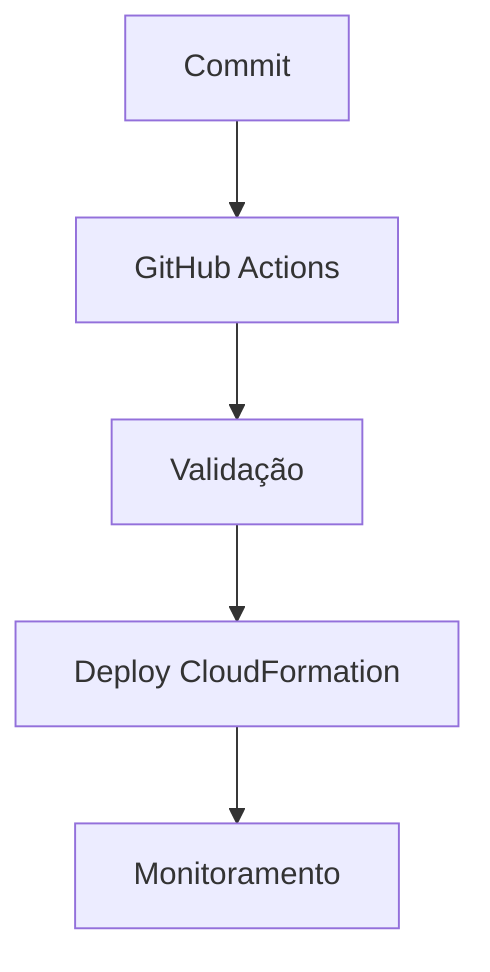

# Boas práticas em AWS CloudFormation e Infrastructure as Code

## Visão geral

A adoção de Infrastructure as Code (IaC) não se resume apenas a escrever templates.

O verdadeiro valor está em como esses templates são estruturados, versionados, validados e operados em ambientes reais.

Este documento consolida as boas práticas aplicadas neste projeto, alinhadas ao AWS Well-Architected Framework e às práticas modernas de DevOps e Platform Engineering.

---

# 1. Estrutura e organização do projeto

Uma boa organização de repositório é fundamental para escalabilidade.

## Separação de responsabilidades

```
templates/        → infraestrutura
scripts/          → automação operacional
docs/             → documentação técnica
.github/          → pipelines CI/CD
```

---

## Princípios aplicados

- cada diretório possui uma responsabilidade única;
- separação clara entre código, automação e documentação;
- fácil navegação e manutenção;
- escalabilidade para novos módulos.

---

# 2. Modularização de templates

Evite criar templates gigantes.

## Recomendado:

- VPC em um template
- EC2 em outro
- IAM separado
- Security Groups isolados

---

## Benefícios:

- reutilização;
- manutenção simplificada;
- testes isolados;
- menor risco de impacto global.

---

# 3. Uso de parâmetros

Templates devem ser dinâmicos.

## Exemplo de boas práticas:

- uso de Parameters para ambiente (dev, prod);
- tipos de instância;
- CIDR blocks;
- nomes de recursos.

---

## Evitar:

- hardcoding de valores;
- duplicação de templates;
- dependência de configurações fixas.

---

# 4. Versionamento com Git

Toda infraestrutura deve ser versionada.

## Práticas recomendadas:

- commits pequenos e descritivos;
- uso de branches (feature, main);
- Pull Requests para revisão;
- histórico auditável.

---

# 5. Validação antes do deploy

Nunca fazer deploy sem validação.

## Ferramentas usadas:

- cfn-lint
- aws cloudformation validate-template
- yq
- shellcheck
- scripts de validação customizados

---

## Objetivo:

- detectar erros antes da AWS;
- reduzir falhas em produção;
- aplicar shift-left testing.

---

# 6. Automação com CI/CD

A infraestrutura deve ser implantada de forma automatizada.

## Pipeline ideal:



---

## Boas práticas:

- separar validação e deploy;
- usar ambientes diferentes;
- executar testes automatizados;
- gerar logs e artefatos.

---

# 7. Segurança

Segurança deve ser aplicada desde o início.

## Boas práticas:

- uso de IAM Roles (não credenciais fixas);
- princípio do menor privilégio;
- uso de OIDC com GitHub Actions;
- evitar exposição de segredos;
- validação de templates antes do deploy.

---

# 8. Observabilidade

Infraestrutura precisa ser observável.

## Implementado no projeto:

- logs de scripts Bash;
- eventos do CloudFormation;
- outputs exportados;
- artifacts no GitHub Actions;
- step summary automatizado.

---

# 9. Gestão de mudanças

Toda mudança deve ser controlada.

## Boas práticas:

- uso de Change Sets em produção;
- revisão de impacto antes do deploy;
- evitar mudanças diretas no console AWS;
- rastreabilidade via Git.

---

# 10. Controle de drift

Evitar divergência entre código e infraestrutura.

## Estratégias:

- proibir mudanças manuais;
- executar drift detection periodicamente;
- auditoria contínua;
- uso exclusivo de CI/CD.

---

# 11. Rollback e resiliência

Sempre considerar falhas como parte do processo.

## Boas práticas:

- confiar no rollback automático do CloudFormation;
- validar templates antes do deploy;
- criar ambientes de teste;
- monitorar execução da Stack.

---

# 12. Documentação

A documentação é parte do sistema.

## Boas práticas:

- documentar decisões técnicas;
- manter docs atualizados com o código;
- explicar arquitetura e não apenas comandos;
- usar linguagem clara e objetiva.

---

# 13. Custos e eficiência

Infraestrutura deve ser eficiente.

## Boas práticas:

- destruir ambientes não utilizados;
- uso de infraestrutura efêmera;
- evitar recursos ociosos;
- automatizar teardown.

---

# 14. Padronização

Padronização reduz erros e aumenta produtividade.

## Inclui:

- naming conventions;
- estrutura de templates;
- padrões de tags;
- formato de logs;
- organização de pipelines.

---

# 15. Evolução contínua

Infraestrutura não é estática.

## Evolução recomendada:

- adoção de multi-account AWS;
- integração com Security Hub;
- uso de ferramentas como Checkov e Trivy;
- testes automatizados de infraestrutura;
- ambientes efêmeros por Pull Request.

---

# Conclusão

Boas práticas não são opcionais em ambientes de produção.

Elas são o que diferencia:

- scripts que “funcionam”
- de sistemas robustos, escaláveis e confiáveis

---

Este projeto aplica princípios reais de engenharia de infraestrutura, aproximando-se de ambientes corporativos modernos baseados em DevOps e Platform Engineering.

---

# Próximo documento

O próximo arquivo abordará **Nested Stacks**, explicando como dividir grandes infraestruturas em módulos reutilizáveis e escaláveis.

---

# Referências

- AWS Well-Architected Framework
- AWS CloudFormation Documentation
- DevOps Engineering Practices
- Infrastructure as Code Principles

---

**Projeto:** Implementando Infraestrutura Automatizada com AWS CloudFormation

**Autor:** Sérgio Luiz dos Santos

**Status:** Completo
