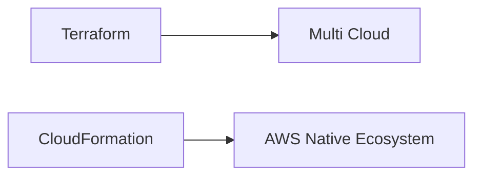

# AWS CloudFormation vs Terraform

## Visão geral

AWS CloudFormation e Terraform são duas das principais ferramentas de Infrastructure as Code (IaC) utilizadas no mercado.

Ambas permitem definir infraestrutura como código, automatizando o provisionamento de recursos em nuvem.

No entanto, existem diferenças fundamentais em filosofia, arquitetura e uso.

---

# Filosofia de cada ferramenta

## CloudFormation

- ferramenta nativa da AWS;
- altamente integrada ao ecossistema AWS;
- modelo declarativo baseado em templates YAML/JSON;
- gerenciamento de estado centralizado na AWS.

> Foco: profundidade e integração com AWS.

---

## Terraform

- ferramenta da HashiCorp;
- multi-cloud (AWS, Azure, GCP, etc.);
- linguagem HCL (HashiCorp Configuration Language);
- estado gerenciado localmente ou em backend remoto.

> Foco: flexibilidade e portabilidade.

---

# Comparação geral

| Característica | CloudFormation | Terraform |
|----------------|----------------|----------|
| Suporte multi-cloud | ❌ Não | ✅ Sim |
| Integração AWS | ⭐ Nativa | Boa |
| Linguagem | YAML / JSON | HCL |
| Gerenciamento de estado | AWS gerencia | Externo (state file) |
| Curva de aprendizado | Média | Média |
| Ecossistema | AWS-only | Multi-cloud |
| Flexibilidade | Média | Alta |

---

# Modelo de estado

## CloudFormation

- estado gerenciado automaticamente pela AWS;
- não há necessidade de arquivos de state locais;
- menos risco de corrupção de estado.

✔ Mais simples operacionalmente  
❌ Menos controle direto

---

## Terraform

- usa state file (terraform.tfstate);
- pode ser local ou remoto (S3, Terraform Cloud);
- exige controle rigoroso do estado.

✔ Mais flexível  
❌ Mais sensível a inconsistências

---

# Linguagem de definição

## CloudFormation (YAML)

```yaml
Resources:
  MyInstance:
    Type: AWS::EC2::Instance
```

✔ Simples  
✔ Nativo AWS  
❌ Verboso em estruturas complexas

---

## Terraform (HCL)

```hcl
resource "aws_instance" "example" {
  instance_type = "t2.micro"
}
```

✔ Mais legível  
✔ Mais expressivo  
✔ Melhor abstração

---

# Integração com AWS

## CloudFormation

- integração profunda com todos os serviços AWS;
- suporte imediato a novos recursos AWS;
- acesso direto a features internas da plataforma.

✔ Melhor para ambientes 100% AWS

---

## Terraform

- suporte via providers;
- depende de atualização da HashiCorp;
- pode haver delay para novos serviços AWS.

✔ Melhor para ambientes multi-cloud

---

# Controle de dependências

Ambas ferramentas gerenciam dependências automaticamente:

## CloudFormation

- `Ref`
- `Fn::GetAtt`
- dependências implícitas

---

## Terraform

- dependency graph automático;
- baseado em referências diretas.

---

# Ciclo de vida da infraestrutura

## CloudFormation

- CREATE
- UPDATE
- DELETE
- ROLLBACK automático

---

## Terraform

- PLAN
- APPLY
- DESTROY

✔ Terraform tem etapa de planejamento explícita (plan)

---

# Change Management

## CloudFormation

- Change Sets permitem revisão antes do deploy;
- forte integração com governança AWS.

---

## Terraform

- terraform plan mostra mudanças antes da aplicação;
- altamente utilizado em pipelines CI/CD.

---

# Segurança

## CloudFormation

- integração com IAM AWS;
- suporte nativo a OIDC;
- menos necessidade de credenciais externas.

---

## Terraform

- depende de providers e credentials externos;
- requer cuidado com state file;
- maior superfície de configuração.

---

# Curva de aprendizado

## CloudFormation

- mais simples para ambientes AWS-only;
- menor flexibilidade;
- mais verboso.

---

## Terraform

- mais poderoso;
- maior complexidade inicial;
- mais usado no mercado geral.

---

# Quando usar CloudFormation?

Use CloudFormation quando:

- o ambiente é 100% AWS;
- você quer integração nativa;
- deseja menos dependência externa;
- precisa de governança AWS forte;
- quer simplicidade operacional.

---

# Quando usar Terraform?

Use Terraform quando:

- há multi-cloud (AWS + Azure + GCP);
- você precisa de portabilidade;
- deseja maior flexibilidade;
- quer padronização entre clouds;
- trabalha em ambientes complexos distribuídos.

---

# Uso neste projeto

Este laboratório utiliza **AWS CloudFormation como tecnologia principal**, porque:

- o foco é AWS;
- há integração com serviços nativos;
- o objetivo é aprendizado profundo em AWS IaC;
- pipelines são baseados em GitHub Actions + AWS.

---

# Visão arquitetural



---

# Vantagens estratégicas

## CloudFormation

- menor complexidade operacional;
- integração profunda AWS;
- menos dependência de ferramentas externas;
- suporte imediato a novos serviços.

---

## Terraform

- maior portabilidade;
- padrão de mercado em ambientes híbridos;
- ecossistema rico de providers;
- abstração mais flexível.

---

# Conclusão

CloudFormation e Terraform não são concorrentes diretos, mas ferramentas com objetivos diferentes.

A escolha depende do contexto:

- AWS-first → CloudFormation
- Multi-cloud → Terraform

---

# Encerramento

Este projeto demonstra o uso avançado do CloudFormation como ferramenta de Infrastructure as Code dentro do ecossistema AWS.

O próximo passo natural seria a exploração de:

- Kubernetes (EKS)
- Terraform em ambientes híbridos
- GitOps com ArgoCD
- Infraestrutura multi-cloud

---

# Referências

- AWS CloudFormation Documentation
- Terraform Documentation (HashiCorp)
- AWS Well-Architected Framework

---

**Projeto:** Implementando Infraestrutura Automatizada com AWS CloudFormation

**Autor:** Sérgio Luiz dos Santos

**Status:** Completo
