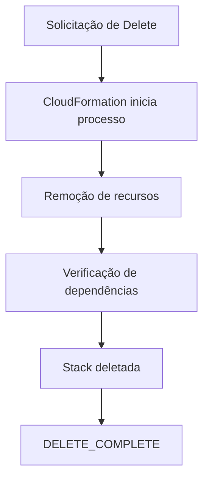
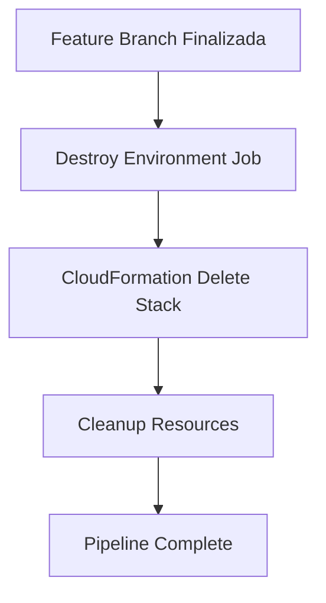

# Exemplo de Delete Stack (Remoção de Infraestrutura)

## Visão geral

Este documento demonstra como remover completamente uma infraestrutura criada com AWS CloudFormation utilizando o processo de **Delete Stack**.

A exclusão de uma Stack remove todos os recursos associados de forma controlada e automatizada.

---

# Quando deletar uma Stack?

Uma Stack deve ser deletada quando:

- o ambiente de testes não é mais necessário;
- a infraestrutura é temporária (ephemeral environments);
- o projeto foi finalizado;
- há necessidade de reduzir custos;
- ambientes de desenvolvimento precisam ser limpos.

---

# Importante

> A exclusão de uma Stack é irreversível.

Todos os recursos gerenciados pela Stack serão removidos permanentemente.

---

# Fluxo de deleção



---

# 1. Delete via AWS CLI

## Comando básico

```bash
aws cloudformation delete-stack \
  --stack-name my-lab-stack
```

---

## O que acontece internamente

- CloudFormation identifica todos os recursos da Stack;
- executa remoção na ordem correta;
- resolve dependências automaticamente;
- remove recursos dependentes;
- finaliza a Stack.

---

# 2. Monitoramento da exclusão

## Ver eventos da Stack

```bash
aws cloudformation describe-stack-events \
  --stack-name my-lab-stack
```

---

## Ver status da Stack

```bash
aws cloudformation describe-stacks \
  --stack-name my-lab-stack
```

Após conclusão, a Stack não aparecerá mais.

---

# 3. Estados durante delete

Durante o processo, a Stack passa por estados como:

- DELETE_IN_PROGRESS
- DELETE_FAILED
- DELETE_COMPLETE

---

# 4. Possíveis falhas na exclusão

## 1. Dependências externas

Recursos podem estar sendo usados fora da Stack.

Exemplo:

- S3 bucket com versionamento ativo;
- EBS volume em uso;
- IAM role com dependências externas.

---

## 2. Proteção de recursos

Alguns recursos podem ter proteção contra exclusão:

- termination protection ativada;
- políticas de retenção (Retain Policy).

---

## 3. Permissões insuficientes

O usuário pode não ter permissão para deletar certos recursos.

---

# 5. Delete com proteção habilitada

Se a Stack tiver termination protection:

```bash
aws cloudformation update-termination-protection \
  --stack-name my-lab-stack \
  --no-enable-termination-protection
```

Depois disso, o delete pode ser executado.

---

# 6. Estratégia segura de delete

Antes de deletar:

## Checklist

- verificar dependências externas;
- garantir que não há dados críticos;
- confirmar ambiente (dev/prod);
- revisar custos e recursos ativos;
- validar logs e outputs.

---

# 7. Boas práticas

## Sempre:

- usar nomes claros para Stacks;
- separar ambientes (dev, staging, prod);
- automatizar deletes em ambientes efêmeros;
- monitorar eventos durante exclusão.

---

## Evitar:

- deletar produção sem validação;
- ignorar dependências externas;
- remover Stack sem backup quando necessário.

---

# 8. Delete em ambientes CI/CD

Em pipelines automatizados:



---

# 9. Impacto da exclusão

A exclusão de uma Stack pode afetar:

- aplicações em execução;
- bancos de dados;
- redes e conectividade;
- dados armazenados.

---

# 10. Casos de uso ideais

## Ambientes temporários

- testes automatizados;
- ambientes por Pull Request;
- laboratórios de aprendizado.

---

## Redução de custos

- limpeza de recursos não utilizados;
- eliminação de infra ociosa.

---

# 11. Comparação com criação

| Create Stack | Delete Stack |
|--------------|--------------|
| Provisiona recursos | Remove recursos |
| Pode falhar por configuração | Pode falhar por dependências |
| Gera infraestrutura | Destrói infraestrutura |

---

# Conclusão

O processo de Delete Stack é tão importante quanto o de criação.

Ele garante:

- controle de custos;
- limpeza de ambientes;
- ciclo de vida completo da infraestrutura.

---

# Encerramento

Este exemplo demonstra como remover uma Stack AWS CloudFormation de forma segura, controlada e automatizada.

---

# Projeto

**Implementando Infraestrutura Automatizada com AWS CloudFormation**

---

# Autor

Sérgio Luiz dos Santos  
GitHub: https://github.com/Santosdevbjj

---

# Status

Exemplo prático de delete de Stack
