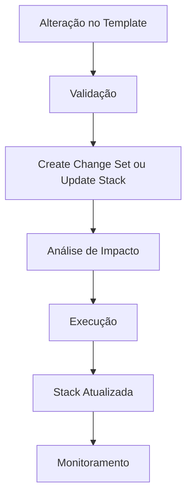
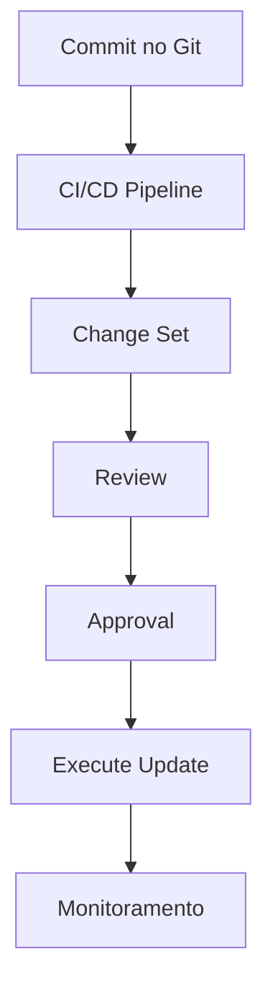

# Exemplo de Atualização de Stack (CloudFormation Update)

## Visão geral

Este documento demonstra como realizar a atualização de uma Stack AWS CloudFormation.

Atualizar uma Stack é uma das operações mais críticas em infraestrutura como código, pois envolve modificar recursos já em produção.

---

# Quando uma Stack precisa ser atualizada?

Uma Stack deve ser atualizada quando houver mudanças no template, como:

- adição de novos recursos;
- modificação de propriedades;
- atualização de parâmetros;
- ajustes de segurança;
- alterações de arquitetura.

---

# Fluxo de atualização



---

# 1. Atualização via AWS CLI (direta)

## Comando básico

```bash
aws cloudformation update-stack \
  --stack-name my-lab-stack \
  --template-body file://templates/main.yaml \
  --capabilities CAPABILITY_NAMED_IAM
```

---

## O que acontece internamente

- CloudFormation compara estado atual com novo template;
- identifica diferenças;
- aplica mudanças necessárias;
- executa rollback automático em caso de falha.

---

# 2. Atualização via Change Set (recomendado)

## Criar Change Set

```bash
aws cloudformation create-change-set \
  --stack-name my-lab-stack \
  --change-set-name update-v2 \
  --template-body file://templates/main.yaml \
  --capabilities CAPABILITY_NAMED_IAM
```

---

## Visualizar mudanças

```bash
aws cloudformation describe-change-set \
  --stack-name my-lab-stack \
  --change-set-name update-v2
```

---

## Executar atualização

```bash
aws cloudformation execute-change-set \
  --stack-name my-lab-stack \
  --change-set-name update-v2
```

---

# 3. Tipos de atualização

## 1. No-op update

Nenhuma mudança detectada.

---

## 2. In-place update

Atualização sem recriação de recursos.

Exemplo:

- alteração de tags;
- mudança de parâmetros não críticos.

---

## 3. Replacement update

Recriação de recursos.

Exemplo:

- alteração de AMI;
- mudança de propriedades imutáveis;
- modificação de VPC.

---

# 4. Atualização de parâmetros

Exemplo de update apenas de parâmetros:

```bash
aws cloudformation update-stack \
  --stack-name my-lab-stack \
  --use-previous-template \
  --parameters ParameterKey=InstanceType,ParameterValue=t3.micro
```

---

# 5. Monitoramento da atualização

## Ver status da Stack

```bash
aws cloudformation describe-stacks \
  --stack-name my-lab-stack
```

---

## Ver eventos detalhados

```bash
aws cloudformation describe-stack-events \
  --stack-name my-lab-stack
```

---

# 6. Estados durante update

- UPDATE_IN_PROGRESS
- UPDATE_COMPLETE_CLEANUP_IN_PROGRESS
- UPDATE_COMPLETE
- UPDATE_ROLLBACK_IN_PROGRESS
- UPDATE_ROLLBACK_COMPLETE

---

# 7. Update com rollback

Se a atualização falhar:

- CloudFormation inicia rollback automático;
- Stack volta ao estado anterior;
- nenhum recurso fica inconsistente.

---

# 8. Exemplo prático

## Situação

Stack atual:

- EC2 t2.micro
- Security Group com porta 80

---

## Mudança aplicada

Alteração no template:

```yaml
InstanceType: t3.micro
```

---

## Resultado esperado

- EC2 será substituída (replacement update)
- novo tipo de instância será aplicado
- IP pode ser alterado

---

# 9. Boas práticas durante updates

## Sempre:

- usar Change Sets antes de produção;
- validar template antes do update;
- revisar impacto de "Replacement";
- monitorar eventos da Stack.

---

## Evitar:

- updates diretos em produção sem análise;
- alterações manuais na AWS Console;
- mudanças sem versionamento.

---

# 10. Impacto de updates em produção

Atualizações podem causar:

- downtime temporário;
- recriação de recursos;
- mudanças de IP;
- reinicialização de serviços.

---

# 11. Estratégia segura de update

Fluxo recomendado:



---

# Conclusão

Atualizar uma Stack CloudFormation é uma operação poderosa, mas que exige cuidado e previsibilidade.

Quando bem utilizada, permite:

- evolução contínua da infraestrutura;
- automação segura;
- redução de risco operacional;
- controle total via código.

---

# Encerramento

Este exemplo demonstra como gerenciar atualizações de infraestrutura de forma segura e automatizada utilizando AWS CloudFormation.

---

# Projeto

**Implementando Infraestrutura Automatizada com AWS CloudFormation**

---

# Autor

Sérgio Luiz dos Santos  
GitHub: https://github.com/Santosdevbjj

---

# Status

Exemplo prático de update de Stack
